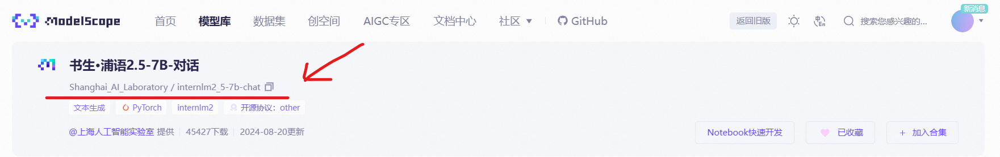
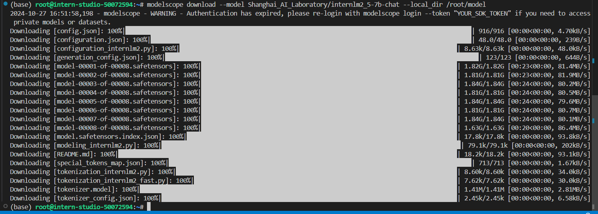
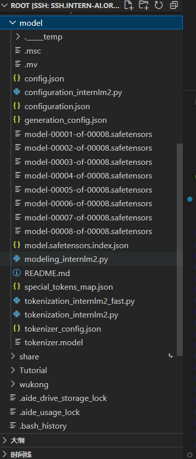
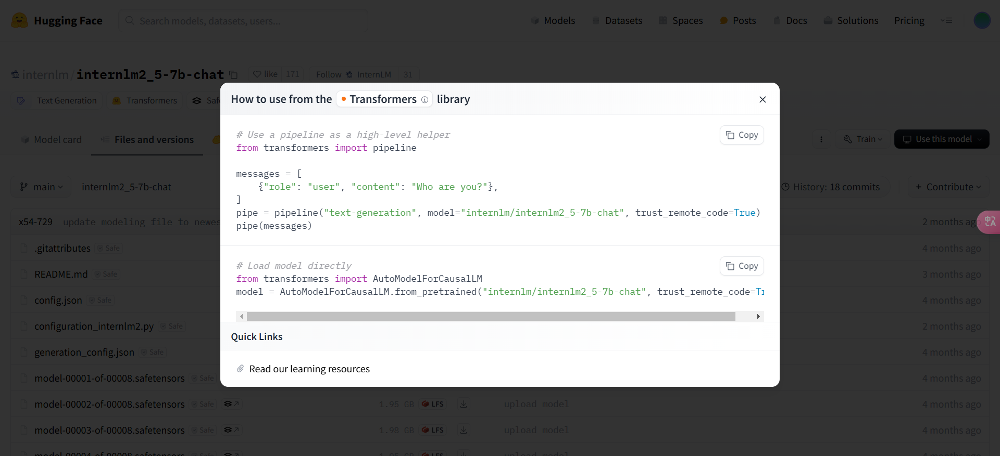
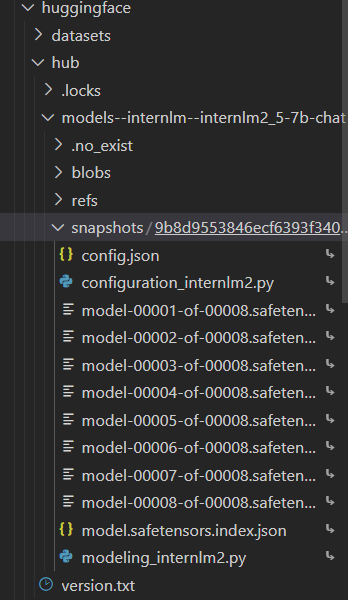
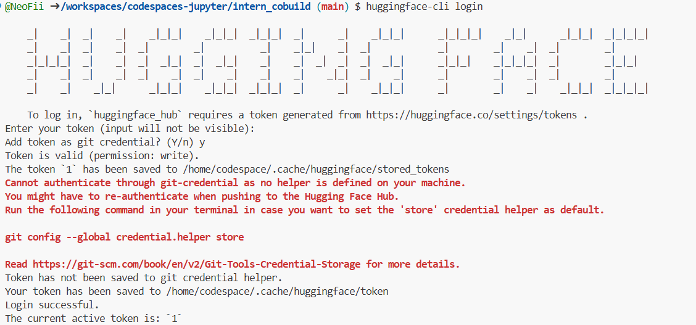
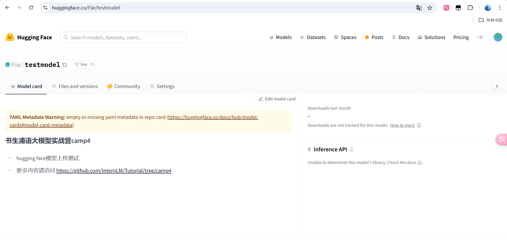
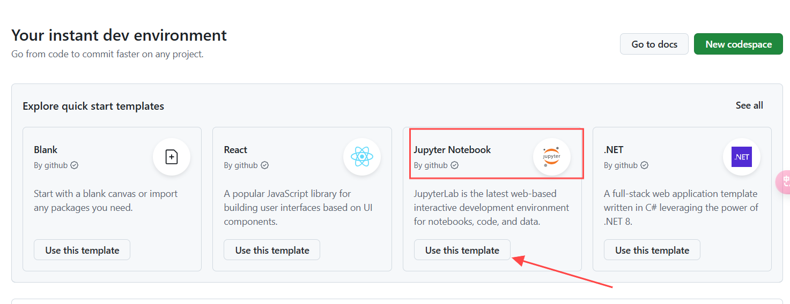
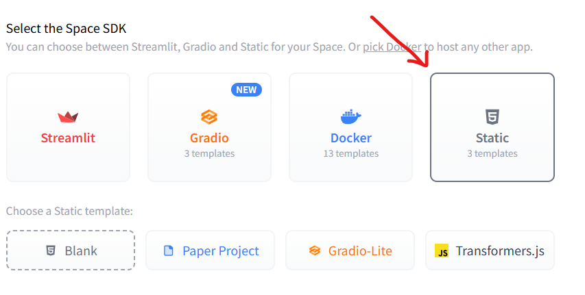
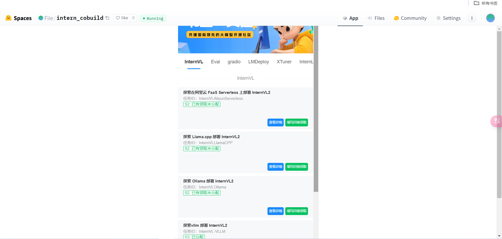

# 模型仓库

## 使用Hugging Face平台、魔搭社区平台（可选）和魔乐社区平台（可选）下载文档中提到的模型

### 使用ModelScope下载模型

首先需要下载依赖

```bash
pip install modelscope
```

然后使用如下命令下载模型

```bash
modelscope download --model Shanghai_AI_Laboratory/internlm2_5-7b-chat --local_dir /root/model
```

参数解释：
--model: 作者和模型名称，需在modelscope中查询
--local_dir: 保存路径



下载结果



这样就会在/root/model目录下生成一个文件夹，里面就是模型文件了



### 使用Hugging Face下载模型

在HuggingFace的Models中搜索InternLM-2.5-7b-chat，然后在右侧的Use this model中选择相应的下载方式



在开发机中要下载依赖 `pip install transformers`

然后将下载代码粘贴进去，然后运行

最后就可以在huggingface文件夹中找到相应的模型文件



## 模型上传

**上传模型到Hugging Face**

在HuggingFace上创建自己的模型

然后将该项目克隆到codespace中

在CodeSpace中下载huggingface依赖

```bash
pip install huggingface_hub
```

然后使用下面的命令登录huggingface账户

```bash
huggingface-cli login
```

将自己的Access Token粘贴进去，终端页面不会显示你的Access Token，回车后输入y即可登陆成功



创建一个readme.md文件，内容如下

```md
# 书生浦语大模型实战营camp4
- hugging face模型上传测试
- 更多内容请访问 https://github.com/InternLM/Tutorial/tree/camp4
```

然后将项目push到HuggingFace上

```bash
git add .
git commit -m "add:intern_study_L0_4"
git push
```

这里需要设置remote origin url

```bash
git remote set-url origin https://github.com/<user_name>/<repo_name>.git
```

设置好后即可推送



注意：这里只是测试，实际上传到自己的仓库中时，模型文件很大需要使用git lfs

```bash
curl -s https://packagecloud.io/install/repositories/github/git-lfs/script.deb.sh | sudo bash
# sudo apt-get install git-lfs # CodeSpace里面可能会有aptkey冲突且没有足够权限
git lfs install # 直接在git环境下配置git LFS
```

## 在HF平台上使用Spaces并把intern_cobuild部署成功

在GitHubSpace中使用Jupyter Notebook模板创建一个自己的Space



在HuggingFacece Space上创建一个自己的Space

template选择Static



然后回到CodeSpace，将项目克隆到CodeSpace中

```bash
cd /workspaces/codespaces-jupyter
git clone https://huggingface.co/spaces/Fiie/intern_cobuild
cd /workspaces/codespaces-jupyter/intern_cobuild
```

找到项目目录下的index.html文件，修改为如下内容

```html
<!doctype html>
<html>
<head>
  <meta charset="utf-8" />
  <meta name="viewport" content="width=device-width" />
  <title>My static Space</title>
  <style>
    html, body {
      margin: 0;
      padding: 0;
      height: 100%;
    }
    body {
      display: flex;
      justify-content: center;
      align-items: center;
    }
    iframe {
      width: 430px;
      height: 932px;
      border: none;
    }
  </style>
</head>
<body>
  <iframe src="https://colearn.intern-ai.org.cn/cobuild" title="description"></iframe>
</body>
</html>
```

保存后将项目push到HuggingFace的Space中

```bash
git add .
git commit -m "update: colearn page"
git push
```

如果报错：remote: Password authentication in git is no longer supported. You must use a user access token or an SSH key instead.
请再次设置这个项目的验证，这个地方需要用户的Access Tokens

```bash
git remote set-url origin https://<user_name>:<token>@huggingface.co/<repo_path>
```

参数解释：
<user_name>: 用户名
<token>: 生成的token，在个人信息页面的Access Tokens中生成
<repo_path>: 仓库路径，例如：Fiie/intern_cobuild

提交成功后，在Hugging Face的Space页面中，可以看到成功运行的页面


